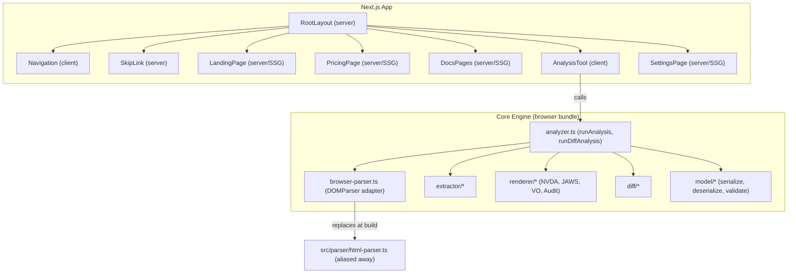

# Design Document: AnnounceKit Site

## Overview

AnnounceKit Site is a full product website built with Next.js (App Router) and React that serves as the public face of the AnnounceKit accessibility analysis tool. The site includes five top-level pages — Landing, Pricing, Documentation, Analysis Tool, and Settings — unified by a shared accessible layout shell. The existing TypeScript core engine (`src/`) is integrated into the browser via the same Vite alias strategy already proven in `web/`, swapping `src/parser/html-parser.ts` for the browser DOMParser adapter to keep jsdom out of the client bundle.

The site's primary architectural goals are:

1. **Accessibility exemplar** — every component uses accessible primitives (Radix UI) and follows WCAG 2.2 AA. The site must practice what AnnounceKit preaches.
2. **SEO for marketing pages** — Landing, Pricing, and Docs are statically generated (SSG) at build time; the Analysis Tool is a client-only interactive page.
3. **Minimal integration surface** — the analyzer service (`runAnalysis`, `runDiffAnalysis`) remains the sole business logic layer. React components call into it exactly as the existing Lit components do.
4. **Freemium acquisition funnel** — the web analysis tool is fully free and ungated. Monetization targets workflow automation (CI/CD, batch, diff) in Pro and Team/Enterprise tiers.

### Technology Choices

| Concern | Choice | Rationale |
|---|---|---|
| Framework | Next.js 14+ (App Router) | SSG for marketing pages, client components for the tool, file-based routing |
| Component primitives | Radix UI | Unstyled, fully accessible primitives (Dialog, Tabs, NavigationMenu, VisuallyHidden) |
| Styling | Tailwind CSS | Utility-first, easy to enforce contrast ratios, responsive breakpoints built-in |
| Syntax highlighting | `shiki` or `rehype-pretty-code` | Static highlighting at build time for Docs code blocks |
| Property-based testing | `fast-check` (already in repo) | Consistent with existing test suite |
| Unit/integration testing | `vitest` (already in repo) | Consistent with existing test suite |
| Bundler | Next.js built-in (Webpack/Turbopack) with custom alias config | Mirrors the Vite alias for browser parser swap |
| Payments | Stripe (Checkout + Customer Portal) | Industry standard for SaaS subscriptions; handles PCI compliance, invoicing, and customer self-service portal out of the box |

## Architecture

### High-Level Architecture



### Rendering Strategy

| Page | Rendering | Reason |
|---|---|---|
| Landing (`/`) | SSG | Static marketing content, SEO critical |
| Pricing (`/pricing`) | SSG | Static content, SEO critical |
| Docs (`/docs/*`) | SSG | Static content generated from markdown/MDX |
| Analysis Tool (`/tool`) | CSR (client component) | Interactive, uses browser DOMParser, no SSR benefit |
| Settings (`/settings`) | SSG | Static placeholder content |
| 404 | SSG | Static error page |

### Routing & Focus Management

Next.js App Router handles routing. A custom `RouteAnnouncer` component (client-side) listens to route changes and:
1. Moves keyboard focus to the `<h1>` of the destination page
2. Announces the page title via an ARIA live region

This mirrors the pattern used by `next/head` but with explicit focus management per Requirement 1.3.

### Build-Time Parser Alias

The Next.js config (`next.config.js`) will include a Webpack alias identical in purpose to the existing Vite config:

```js
webpack: (config) => {
  config.resolve.alias['@core/parser/html-parser'] = 
    path.resolve(__dirname, 'src/browser-parser.ts');
  return config;
}
```

This ensures all `@core` imports in client bundles resolve the browser DOMParser adapter, keeping jsdom out of the browser bundle (Requirement 7.1, 7.2).

## Components and Interfaces

### Layout Shell

```
RootLayout
├── SkipLink              — first focusable element, jumps to #main-content
├── Navigation            — <nav aria-label="Main navigation">
│   ├── Logo/Home link
│   ├── NavLinks (Landing, Pricing, Docs, Tool, Settings)
│   ├── aria-current="page" on active link
│   └── MobileMenuToggle  — <button aria-label="Menu"> for < 768px
├── <main id="main-content">
│   └── {page content}
└── Footer
```

### Navigation Component

```typescript
interface NavigationProps {
  // No props needed — reads current path from usePathname()
}

// Internal state:
// - mobileMenuOpen: boolean
// - Keyboard: Escape closes menu, returns focus to toggle
// - On route change: close mobile menu
```

**Behavior:**
- Renders as `<nav aria-label="Main navigation">`
- Active link gets `aria-current="page"`
- Below 768px: collapses to hamburger toggle button labeled "Menu"
- On mobile open: focus moves to first link
- On Escape: closes menu, focus returns to toggle button
- Uses Radix `NavigationMenu` or custom implementation with proper keyboard support

### SkipLink Component

```typescript
// Server component — no client JS needed
// Renders: <a href="#main-content" class="sr-only focus:not-sr-only">
//            Skip to main content
//          </a>
```

### RouteAnnouncer Component

```typescript
// Client component
// On pathname change:
//   1. Find the <h1> in main content
//   2. Set tabindex="-1" on it (if not already focusable)
//   3. Call h1.focus()
//   4. Update ARIA live region with page title
```

### Analysis Tool Components

```
AnalysisToolPage (client component)
├── HtmlInput             — textarea + file upload
│   ├── <textarea aria-label="HTML input" aria-describedby="html-error">
│   ├── FileUpload        — <input type="file" accept=".html,.htm">
│   └── ErrorMessage      — inline error via aria-describedby
├── OptionsBar
│   ├── ScreenReaderSelect — <select> or Radix Select for NVDA/JAWS/VO/All
│   ├── CssSelectorInput  — <input type="text" aria-label="CSS selector">
│   └── DiffModeToggle    — <button aria-pressed> or Radix Toggle
├── AnalyzeButton         — <button> with loading state
├── LoadingIndicator      — aria-busy="true" on results region
├── LiveRegion            — role="status" aria-live="polite" for announcements
├── ResultsTabs (Radix Tabs)
│   ├── TabList           — role="tablist"
│   │   ├── Tab: Announcements
│   │   ├── Tab: Audit Report
│   │   ├── Tab: JSON Model
│   │   └── Tab: Semantic Diff (visible when diff mode on)
│   └── TabPanels
│       ├── AnnouncementsPanel
│       ├── AuditPanel
│       ├── JsonModelPanel  — <pre><code> + CopyButton
│       └── DiffPanel
└── DiffInputs (conditional)
    ├── HtmlInput (before)
    └── HtmlInput (after)
```

### Key Component Interfaces

```typescript
// Analysis Tool state (managed via useReducer or useState)
interface AnalysisToolState {
  html: string;
  htmlBefore: string;
  diffMode: boolean;
  screenReader: ScreenReaderOption; // 'NVDA' | 'JAWS' | 'VoiceOver' | 'All'
  cssSelector: string;
  loading: boolean;
  result: AnalysisResult | null;
  error: string | null;
}

// HtmlInput component
interface HtmlInputProps {
  label: string;
  value: string;
  onChange: (value: string) => void;
  onError: (error: string | null) => void;
  disabled?: boolean;
  errorMessage?: string | null;
}

// ResultsTabs component
interface ResultsTabsProps {
  result: AnalysisResult | null;
  screenReader: ScreenReaderOption;
  diffMode: boolean;
  loading: boolean;
}

// CopyButton component
interface CopyButtonProps {
  text: string;        // content to copy
  label?: string;      // accessible label, default "Copy to clipboard"
}
// On click: copies text, announces "Copied to clipboard" via live region
```

### Docs Page Components

```
DocsLayout
├── DocsSidebar           — <nav aria-label="Documentation navigation">
│   ├── SectionLinks (API Reference, Usage Guide, Examples, CI/CD Guide)
│   └── CollapsibleOnMobile — disclosure widget below 768px
├── DocsContent
│   ├── MDX rendered content
│   ├── CodeBlock         — <pre><code> with syntax highlighting + CopyButton
│   └── LiveRegion        — announces "Copied to clipboard"
```

### Pricing Page Components

```
PricingPage
├── <h1>Pricing</h1>
├── TierCardGroup         — accessible list/group
│   ├── TierCard (Free)   — labeled region
│   ├── TierCard (Pro)    — labeled region, visually highlighted
│   └── TierCard (Team/Enterprise) — labeled region
└── ComingSoonNote
```

```typescript
interface TierCardProps {
  name: string;
  price: string;              // "Free", "$15–25/mo per seat", "Custom pricing"
  features: string[];
  recommended?: boolean;
  ctaLabel: string;
  ctaHref: string;
}
```

### Stripe Payment Integration

Payment processing uses Stripe Checkout for subscription sign-ups and the Stripe Customer Portal for self-service management (upgrades, downgrades, cancellations, invoice history).

**Flow:**
1. User clicks a tier CTA on the Pricing page
2. Free tier → redirects to the Analysis Tool (no payment needed)
3. Pro tier → calls a Next.js API route (`/api/checkout`) that creates a Stripe Checkout Session with the Pro price ID, then redirects the user to Stripe's hosted checkout page
4. Team/Enterprise tier → redirects to a "Contact Sales" form or mailto link (custom pricing, not self-serve)
5. After successful checkout, Stripe redirects back to `/settings?session_id={id}` where the app confirms the subscription
6. Existing subscribers access the Stripe Customer Portal via a button in the Settings page (`/api/portal` creates a portal session)

**Architecture notes:**
- Stripe API calls happen exclusively in Next.js API routes (server-side) — the Stripe secret key never reaches the client
- Stripe webhook endpoint (`/api/webhooks/stripe`) handles `checkout.session.completed`, `customer.subscription.updated`, and `customer.subscription.deleted` events
- Subscription status is stored minimally (customer ID, subscription tier, status) — Stripe is the source of truth
- The free tier requires no Stripe interaction at all
- PCI compliance is handled entirely by Stripe Checkout (no card data touches our servers)

### Future: Accessibility Remediation Guidance (post-V1)

A planned enhancement where the Analysis Tool, after generating screen reader output predictions, evaluates whether the output would be considered accessible and provides actionable guidance to correct the HTML markup if not. This could include:

- Detecting missing or empty accessible names on interactive elements
- Flagging missing landmark roles, heading hierarchy violations, or absent ARIA attributes
- Suggesting specific HTML/ARIA fixes inline alongside the audit report (e.g., "Add `aria-label` to this `<button>`" or "This `` is missing `alt` text")
- Severity levels (error vs. warning) aligned with WCAG 2.2 AA success criteria
- Potentially integrating an LLM-assisted suggestion engine for more nuanced remediation advice

This is scoped as a post-V1 feature and will be covered in a separate spec (likely tied to the core engine expansion workstream). The V1 audit report already surfaces issues — this enhancement would add the "how to fix it" layer on top.

## Data Models

### Application State

The Analysis Tool page manages local component state. No global state management library is needed — the tool is a single-page interactive widget.

```typescript
// Re-exported from existing analyzer.ts — no new types needed
import type {
  AnalysisResult,
  AnalysisEntry,
  ScreenReaderOption,
  AnalysisParams,
  DiffAnalysisParams,
  SemanticDiff,
} from './analyzer';
```

### Existing Core Types (unchanged)

The following types from `src/model/types.ts` are used as-is:

- `AnnouncementModel` — root of the canonical accessibility tree
- `AccessibleNode` — single node with role, name, state, focus, children
- `AccessibleState` — ARIA states and properties
- `AccessibleValue` — form control values
- `FocusInfo` — focusability information
- `ModelVersion` — version for forward compatibility

### Existing Diff Types (unchanged)

From `src/diff/types.ts`:

- `SemanticDiff` — changes array + summary counts
- `NodeChange` — type, path, node, property changes
- `PropertyChange` — property name, old/new values

### Docs Content Model

Documentation pages are authored as MDX files and statically generated at build time. No runtime data model is needed — content is compiled to React components during the build.

```
docs/
├── api-reference.mdx
├── usage-guide.mdx
├── examples.mdx
└── cicd-integration.mdx
```

### Pricing Tier Data

Pricing tiers are defined as static data (no API calls):

```typescript
interface PricingTier {
  id: 'free' | 'pro' | 'team-enterprise';
  name: string;
  price: string;
  features: string[];
  recommended: boolean;
  ctaLabel: string;
}

const PRICING_TIERS: PricingTier[] = [
  {
    id: 'free',
    name: 'Free',
    price: 'Free',
    features: [
      'Unlimited web tool usage',
      'Single-file CLI analysis',
      'All screen readers (NVDA, JAWS, VoiceOver)',
      'Audit report generation',
    ],
    recommended: false,
    ctaLabel: 'Get Started',
  },
  {
    id: 'pro',
    name: 'Pro',
    price: '$15–25/mo per seat',
    features: [
      'Everything in Free',
      'Batch processing (multiple files)',
      'CI/CD pipeline integration',
      'Semantic diff (before/after comparison)',
      'Priority support',
    ],
    recommended: true,
    ctaLabel: 'Start Pro Trial',
  },
  {
    id: 'team-enterprise',
    name: 'Team / Enterprise',
    price: 'Custom pricing',
    features: [
      'Everything in Pro',
      'Shared team dashboards & historical reports',
      'Custom rule configuration',
      'SSO / SAML authentication',
      'SLA & dedicated support',
      'Volume pricing',
    ],
    recommended: false,
    ctaLabel: 'Contact Sales',
  },
];
```

### Navigation Route Data

```typescript
interface NavRoute {
  label: string;
  href: string;
}

const NAV_ROUTES: NavRoute[] = [
  { label: 'Home', href: '/' },
  { label: 'Pricing', href: '/pricing' },
  { label: 'Docs', href: '/docs' },
  { label: 'Analyzer', href: '/tool' },
  { label: 'Settings', href: '/settings' },
];
```


## Correctness Properties

*A property is a characteristic or behavior that should hold true across all valid executions of a system — essentially, a formal statement about what the system should do. Properties serve as the bridge between human-readable specifications and machine-verifiable correctness guarantees.*

### Property 1: Landmark structure on all pages

*For any* page in the site, the rendered HTML SHALL contain exactly one `<main>` landmark and at least one `<nav>` landmark.

**Validates: Requirements 1.1**

### Property 2: Skip link is first focusable element

*For any* page in the site, the first focusable element in DOM order SHALL be a skip link whose target is the main content area (`#main-content`).

**Validates: Requirements 1.2**

### Property 3: Focus moves to heading on route change

*For any* route transition from page A to page B, after navigation completes, `document.activeElement` SHALL be the `<h1>` element inside the `<main>` content area of page B.

**Validates: Requirements 1.3**

### Property 4: All images have alt attributes

*For any* `` element rendered on any page, the element SHALL have an `alt` attribute (either descriptive text or empty string for decorative images).

**Validates: Requirements 1.7**

### Property 5: Active navigation link matches current route

*For any* route in the site, exactly one link in the main navigation SHALL have `aria-current="page"`, and that link's `href` SHALL match the current route path.

**Validates: Requirements 2.2**

### Property 6: No skipped heading levels on any page

*For any* page in the site, the sequence of heading levels (h1–h6) SHALL not skip levels (e.g., h1 followed by h3 without an intervening h2).

**Validates: Requirements 3.5**

### Property 7: File upload extension validation

*For any* file with an extension that is not `.html` or `.htm`, the file upload handler SHALL reject the file and produce an error message. *For any* file with a `.html` or `.htm` extension, the upload SHALL be accepted.

**Validates: Requirements 6.3**

### Property 8: Valid HTML always produces analysis results

*For any* non-empty HTML string within the size limit, calling `runAnalysis` SHALL return an `AnalysisResult` with at least one entry containing a non-null `AnnouncementModel`, non-empty announcement strings, a non-empty audit string, and valid JSON in the `json` field.

**Validates: Requirements 6.7**

### Property 9: Tab pattern correctness

*For any* tab in the results tablist, the tab element SHALL have `role="tab"` with an `aria-controls` attribute pointing to a valid `role="tabpanel"` element, and when that tab is selected, `aria-selected` SHALL be `"true"`, the corresponding panel SHALL be visible, and focus SHALL move into the panel content.

**Validates: Requirements 6.9, 6.10**

### Property 10: Result panels display correct analysis output

*For any* valid HTML input and selected screen reader option, the Announcements panel SHALL display the output from the corresponding renderer (NVDA, JAWS, VoiceOver, or all three), and the Audit panel SHALL display the output from `renderAuditReport`.

**Validates: Requirements 6.11, 6.12**

### Property 11: JSON model panel round-trip

*For any* valid HTML input, the JSON displayed in the JSON Model panel SHALL be valid JSON that, when deserialized via `deserializeModel`, produces an `AnnouncementModel` equivalent to the original analysis result's model.

**Validates: Requirements 6.13**

### Property 12: Diff analysis produces semantic diff

*For any* two non-empty valid HTML strings within the size limit, calling `runDiffAnalysis` SHALL return an `AnalysisResult` with a non-null `diff` field containing a `SemanticDiff` with a `summary` object that has numeric `added`, `removed`, and `changed` counts.

**Validates: Requirements 6.15**

### Property 13: Announcement model round-trip (browser context)

*For any* valid HTML input, parsing via the browser parser, building the accessibility tree, serializing the model to JSON, and deserializing it back SHALL produce an equivalent `AnnouncementModel`.

**Validates: Requirements 7.4**

### Property 14: Accessible error display without internal details

*For any* error thrown by the core engine during analysis, the error message displayed to the user SHALL NOT contain stack traces, file paths, or internal module names, AND the error SHALL be rendered in a container with `role="alert"` or associated with the relevant input via `aria-describedby`.

**Validates: Requirements 10.2, 10.3**

### Property 15: User input preserved on error

*For any* error that occurs during analysis, the HTML content in the input field(s) and the selected options (screen reader, CSS selector, diff mode) SHALL remain unchanged after the error is displayed.

**Validates: Requirements 10.4**

## Error Handling

### Analysis Errors

The Analysis Tool catches all errors from the core engine at the top-level handler (mirroring the existing `ak-app.ts` pattern):

| Error Type | Source | User-Facing Message | Display Method |
|---|---|---|---|
| `ParsingError` (empty input) | `validateHTMLNotEmpty` | "HTML input is empty or contains only whitespace" | Inline via `aria-describedby` on input |
| `ParsingError` (size limit) | `assertWithinSizeLimit` | "HTML input exceeds the 2 MB size limit" | Live region (`role="status"`) |
| `SelectorError` (invalid) | `buildAccessibilityTreeWithSelector` | "No elements match selector: ..." | Live region (`role="status"`) |
| Unexpected `Error` | Any core module | "An unexpected error occurred. Please try again." | `role="alert"` container |
| File type rejection | File upload handler | "Only .html and .htm files are accepted" | Live region (`role="status"`) |

### Error Display Rules

1. Errors associated with a specific input field use `aria-describedby` linking the error message `<div>` to the input.
2. Global errors (size limit, unexpected) use a `role="alert"` banner.
3. Internal error details (stack traces, module paths) are never exposed to the user.
4. User input is always preserved when an error occurs — the state is never cleared.

### Navigation Errors

- Unknown routes render a static 404 page with an `<h1>`, descriptive message, and a link back to `/`.
- The 404 page follows the same layout shell (skip link, navigation, landmarks).

### Copy-to-Clipboard Errors

- If the Clipboard API fails (e.g., permissions denied), the copy button displays "Copy failed" and the live region announces the failure.

## Testing Strategy

### Dual Testing Approach

The site uses both unit tests and property-based tests for comprehensive coverage:

- **Unit tests** verify specific examples, edge cases, structural checks, and integration points
- **Property-based tests** verify universal properties across randomly generated inputs

Both are complementary: unit tests catch concrete bugs in specific scenarios, property tests verify general correctness across the input space.

### Test Framework

- **Test runner:** Vitest (already used in the project)
- **Property-based testing:** fast-check (already in `devDependencies`)
- **Component testing:** Vitest + `@testing-library/react` for React component tests
- **Accessibility testing:** `jest-axe` (via `vitest-axe`) for automated ARIA/WCAG checks in unit tests

### Property-Based Test Configuration

- Each property test runs a minimum of **100 iterations**
- Each property test is tagged with a comment referencing the design property:
  ```
  // Feature: announcekit-site, Property {N}: {property title}
  ```
- Each correctness property is implemented by a **single** property-based test
- Generators produce random valid HTML strings, file names with various extensions, screen reader options, and CSS selectors

### Unit Test Coverage

Unit tests focus on:

- **Structural examples:** Landing page has h1, features section, CTAs (Requirements 3.1–3.4)
- **Pricing page content:** Three tiers with correct features, labeled regions (Requirements 4.1–4.8)
- **Docs structure:** Sidebar nav, code blocks, copy button (Requirements 5.1–5.7)
- **Analysis Tool UI:** Input area, file upload, options bar, analyze button (Requirements 6.1–6.6)
- **Settings placeholder:** Heading, placeholder sections (Requirements 8.1–8.3)
- **404 page:** Heading, message, home link (Requirement 10.1)
- **Mobile navigation:** Menu toggle, Escape key behavior (Requirements 2.5–2.6)
- **Edge cases:** Empty input, oversized input, invalid CSS selectors (Requirements 6.16–6.18)
- **Loading state:** aria-busy and live region during analysis (Requirement 6.19)

### Property-Based Test Coverage

| Property | Test Description | Generator |
|---|---|---|
| 1: Landmarks | Render each page, assert main + nav landmarks | Enumerate all routes |
| 2: Skip link | Render each page, assert first focusable is skip link | Enumerate all routes |
| 3: Focus on route change | Simulate navigation, assert focus on h1 | Random pairs of routes |
| 4: Image alt attributes | Render pages, assert all img have alt | Enumerate all routes |
| 5: Active nav link | Render nav at each route, assert aria-current | Enumerate all routes |
| 6: Heading hierarchy | Render each page, extract heading levels, assert no skips | Enumerate all routes |
| 7: File extension validation | Generate random filenames, assert accept/reject | Random strings + extensions |
| 8: Valid HTML produces results | Generate random HTML, call runAnalysis | Random valid HTML fragments |
| 9: Tab pattern | Render tabs, select each, assert ARIA + focus | Enumerate all tab indices |
| 10: Result panel content | Analyze random HTML, check panel content matches renderer | Random HTML + screen reader option |
| 11: JSON round-trip | Analyze random HTML, parse JSON panel, compare model | Random valid HTML fragments |
| 12: Diff analysis | Generate two random HTMLs, call runDiffAnalysis | Pairs of random HTML fragments |
| 13: Model round-trip (browser) | Parse, build tree, serialize, deserialize, compare | Random valid HTML fragments |
| 14: Error display | Throw various errors, assert no internals + ARIA | Random error messages |
| 15: Input preserved on error | Set input, trigger error, assert input unchanged | Random HTML + error-triggering inputs |
