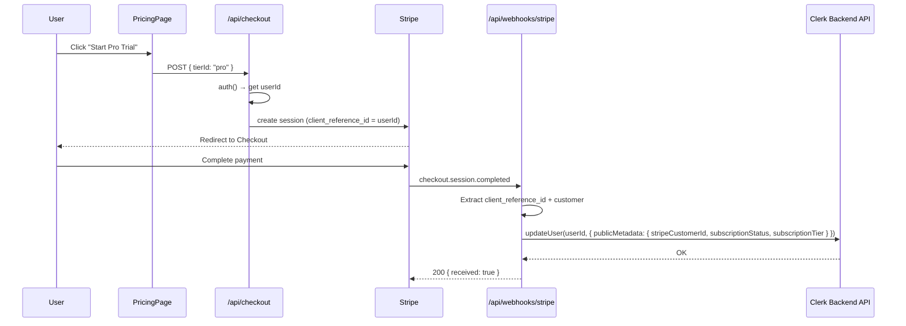

# Design Document: Auth Integration

## Overview

This design adds Clerk-based authentication to the AnnounceKit Next.js App Router site using fully custom UI (no pre-built Clerk components). The integration connects Clerk user identity to the existing Stripe billing infrastructure, enabling user-aware subscription management, protected routes, and conditional UI throughout the site.

Key design decisions:
- **Custom UI only**: All auth forms use Clerk's React hooks (`useSignUp`, `useSignIn`, `useUser`, `useAuth`) with Tailwind-styled components, matching the existing site design system.
- **Server-side middleware**: Route protection uses Clerk's `clerkMiddleware` in `site/middleware.ts`, keeping auth checks at the edge.
- **Stripe ↔ Clerk linking**: The existing Stripe webhook handler is extended to write subscription data into Clerk `publicMetadata`, making plan info available client-side without additional API calls.
- **Minimal new dependencies**: Only `@clerk/nextjs` is added. The existing `stripe` package and API routes are reused.

## Architecture

```mermaid
graph TD
    subgraph "Next.js App Shell"
        A[RootLayout + ClerkProvider] --> B[Navigation]
        A --> C[Pages]
    end

    subgraph "Auth Pages"
        C --> D[/sign-up → SignUpForm + VerificationForm]
        C --> E[/sign-in → SignInForm]
    end

    subgraph "Protected Pages"
        C --> F[/settings → SettingsPage]
    end

    subgraph "Conditional Pages"
        C --> G[/pricing → PricingPage]
    end

    subgraph "Middleware Layer"
        H[site/middleware.ts - clerkMiddleware] -->|protects /settings| F
        H -->|allows public routes| D
        H -->|allows public routes| E
        H -->|allows public routes| G
    end

    subgraph "API Routes"
        I[/api/checkout] -->|client_reference_id = Clerk userId| J[Stripe Checkout]
        K[/api/webhooks/stripe] -->|writes publicMetadata| L[Clerk Backend API]
        M[/api/portal] --> N[Stripe Customer Portal]
    end

    J -->|checkout.session.completed| K
    F -->|Manage Subscription| M
```

### Data Flow: Stripe ↔ Clerk Linking



## Components and Interfaces

### File Structure

```
site/
├── middleware.ts                          # NEW — Clerk clerkMiddleware
├── app/
│   ├── layout.tsx                         # MODIFIED — wrap in ClerkProvider
│   ├── sign-up/
│   │   └── page.tsx                       # NEW — custom sign-up page
│   ├── sign-in/
│   │   └── page.tsx                       # NEW — custom sign-in page
│   ├── pricing/
│   │   └── page.tsx                       # MODIFIED — conditional CTAs
│   ├── settings/
│   │   └── page.tsx                       # MODIFIED — real account dashboard
│   └── api/
│       ├── checkout/
│       │   └── route.ts                   # MODIFIED — add auth + client_reference_id
│       ├── portal/
│       │   └── route.ts                   # MODIFIED — add auth guard
│       └── webhooks/stripe/
│           └── route.ts                   # MODIFIED — write Clerk publicMetadata
├── components/
│   ├── Navigation.tsx                     # MODIFIED — auth state awareness
│   ├── SignUpForm.tsx                     # NEW — custom sign-up form
│   ├── SignInForm.tsx                     # NEW — custom sign-in form
│   └── VerificationForm.tsx              # NEW — email verification code form
```

### Component Interfaces

#### `ClerkProvider` (in `layout.tsx`)

Wraps the entire app in `<ClerkProvider>` from `@clerk/nextjs`. Configured via `NEXT_PUBLIC_CLERK_PUBLISHABLE_KEY` env var. Placed inside `<body>` wrapping `<LiveRegionProvider>` and all children.

```tsx
// site/app/layout.tsx
import { ClerkProvider } from '@clerk/nextjs';

export default function RootLayout({ children }: { children: React.ReactNode }) {
  return (
    <html lang="en" className="scroll-smooth">
      <body>
        <ClerkProvider>
          <LiveRegionProvider>
            {/* existing content */}
          </LiveRegionProvider>
        </ClerkProvider>
      </body>
    </html>
  );
}
```

#### `SignUpForm`

Client component using Clerk's `useSignUp()` hook.

```tsx
interface SignUpFormProps {
  onVerificationRequired: () => void;
}

// Internal state machine:
// "form" → user fills email/password/confirmPassword
// Calls signUp.create() then signUp.prepareEmailAddressVerification()
// On success, calls onVerificationRequired to switch to VerificationForm
```

- Three labeled inputs: email, password, confirm password
- Client-side validation: password match check before calling Clerk
- Displays Clerk API errors (duplicate email, weak password) via `aria-describedby`
- On validation error, focuses the first errored input
- Link to `/sign-in`: "Already have an account? Sign in"

#### `VerificationForm`

Client component for the email verification code step.

```tsx
interface VerificationFormProps {
  onSuccess: () => void;
}

// Uses signUp.attemptEmailAddressVerification({ code })
// On success, calls setActive({ session }) then onSuccess (redirect to /tool)
// On error, displays message and offers "Resend code" button
```

- Single labeled input for the 6-digit verification code
- Auto-focuses the code input on mount
- Error display for invalid/expired codes
- "Resend code" button calls `signUp.prepareEmailAddressVerification()` again

#### `SignInForm`

Client component using Clerk's `useSignIn()` hook.

```tsx
// Uses signIn.create({ identifier: email, password })
// On success, calls setActive({ session }) then redirects to /tool
// On error, displays generic "Invalid credentials" message (never reveals if email exists)
```

- Two labeled inputs: email, password
- Generic error message for all auth failures (security: no email enumeration)
- On validation error, focuses the first errored input
- "Forgot password?" link initiates `signIn.create({ strategy: 'reset_password_email_code' })`
- Link to `/sign-up`: "Don't have an account? Sign up"

#### `Navigation` (modified)

```tsx
// Uses useUser() for user data (name, imageUrl)
// Uses useAuth() for isSignedIn, isLoaded, signOut

// Rendering logic:
// if (!isLoaded) → render placeholder skeleton (non-interactive)
// if (isSignedIn) → render user avatar + name + "Sign Out" button + "Get Started" → /tool
// else → render "Log In" → /sign-in + "Sign Up" → /sign-up + "Get Started" → /sign-up
```

#### `SettingsPage` (modified)

Server component that reads Clerk user data.

```tsx
// Uses useUser() to get:
//   - user.fullName, user.primaryEmailAddress
//   - user.publicMetadata.stripeCustomerId
//   - user.publicMetadata.subscriptionTier
//   - user.publicMetadata.subscriptionStatus

// Display logic:
// Plan: publicMetadata.subscriptionTier || "Free"
// Manage Subscription button:
//   enabled if stripeCustomerId && subscriptionStatus === "active"
//   disabled otherwise, with helper text "Available for paid plans"
// Sign Out button: calls signOut() → redirect to /
```

### Middleware Configuration

```tsx
// site/middleware.ts
import { clerkMiddleware, createRouteMatcher } from '@clerk/nextjs/server';

const isProtectedRoute = createRouteMatcher(['/settings(.*)']);

export default clerkMiddleware(async (auth, req) => {
  if (isProtectedRoute(req)) {
    await auth.protect();
  }
});

export const config = {
  matcher: [
    '/((?!_next|[^?]*\\.(?:html?|css|js(?!on)|jpe?g|webp|png|gif|svg|ttf|woff2?|ico|csv|docx?|xlsx?|zip|webmanifest)).*)',
    '/(api|trpc)(.*)',
  ],
};
```

Sign-in and sign-up redirect paths are configured via environment variables:
- `NEXT_PUBLIC_CLERK_SIGN_IN_URL=/sign-in`
- `NEXT_PUBLIC_CLERK_SIGN_UP_URL=/sign-up`

## Data Models

### Clerk User `publicMetadata` Schema

The Stripe webhook handler writes the following fields to the Clerk user's `publicMetadata`:

```typescript
interface ClerkPublicMetadata {
  stripeCustomerId?: string;      // Stripe customer ID (e.g., "cus_xxx")
  subscriptionStatus?: string;    // Stripe subscription status: "active" | "past_due" | "canceled" | "trialing" | etc.
  subscriptionTier?: string;      // "pro" | "enterprise" — absent for free users
}
```

### Stripe Checkout Session (modified)

```typescript
// When creating a checkout session, include:
{
  mode: 'subscription',
  client_reference_id: clerkUserId,  // NEW — links session to Clerk user
  line_items: [{ price: priceId, quantity: 1 }],
  success_url: '...',
  cancel_url: '...',
}
```

### Webhook Event Processing

| Stripe Event | Action |
|---|---|
| `checkout.session.completed` | Extract `client_reference_id` (Clerk userId) and `customer` (Stripe customerId). Call Clerk Backend API: `clerkClient.users.updateUser(userId, { publicMetadata: { stripeCustomerId, subscriptionStatus: 'active', subscriptionTier: 'pro' } })` |
| `customer.subscription.updated` | Look up Clerk user by `stripeCustomerId` in metadata. Update `subscriptionStatus` to match Stripe subscription status. |
| `customer.subscription.deleted` | Look up Clerk user by `stripeCustomerId`. Set `subscriptionStatus: 'canceled'`, remove `subscriptionTier`. |

### Environment Variables (new)

```
NEXT_PUBLIC_CLERK_PUBLISHABLE_KEY=pk_...
CLERK_SECRET_KEY=sk_...
NEXT_PUBLIC_CLERK_SIGN_IN_URL=/sign-in
NEXT_PUBLIC_CLERK_SIGN_UP_URL=/sign-up
```


## Correctness Properties

*A property is a characteristic or behavior that should hold true across all valid executions of a system — essentially, a formal statement about what the system should do. Properties serve as the bridge between human-readable specifications and machine-verifiable correctness guarantees.*

### Property 1: Protected route middleware rejects unauthenticated access

*For any* HTTP request to the `/settings` route without a valid Clerk session, the middleware shall redirect the request to `/sign-in` and never return the settings page content.

**Validates: Requirements 1.4, 1.5, 5.1**

### Property 2: Public routes allow unauthenticated access

*For any* route in the set `{/, /pricing, /docs, /tool, /sign-up, /sign-in}`, an unauthenticated request shall be allowed through the middleware without redirect.

**Validates: Requirements 1.6, 5.2**

### Property 3: Password mismatch rejection on sign-up

*For any* two strings where `password !== confirmPassword`, submitting the sign-up form shall produce a validation error and the form state shall remain unchanged (no Clerk API call made).

**Validates: Requirements 2.9**

### Property 4: Sign-in error message does not leak email existence

*For any* failed sign-in attempt (whether the email exists or not), the displayed error message shall be identical — a generic "Invalid credentials" message that does not reveal whether the email address is registered.

**Validates: Requirements 3.6, 3.7**

### Property 5: Navigation renders correct controls for auth state

*For any* authentication state, the Navigation component shall render: (a) if unauthenticated — "Log In" linking to `/sign-in`, "Sign Up" linking to `/sign-up`, and "Get Started" linking to `/sign-up`; (b) if authenticated — the user's name, avatar, "Sign Out" button, and "Get Started" linking to `/tool`.

**Validates: Requirements 4.1, 4.2, 4.4, 4.5**

### Property 6: Pricing CTA destinations depend on auth state

*For any* pricing tier CTA button, while the user is unauthenticated the link shall point to `/sign-up`; while authenticated, the Pro tier CTA shall initiate the Stripe Checkout flow and the Team/Enterprise CTA shall link to the contact sales destination.

**Validates: Requirements 5.3, 5.4, 5.5, 5.6**

### Property 7: Checkout session includes Clerk user ID

*For any* authenticated request to the checkout route that creates a Stripe Checkout Session, the session's `client_reference_id` field shall equal the authenticated Clerk user ID.

**Validates: Requirements 6.1**

### Property 8: Checkout route rejects unauthenticated requests

*For any* request to `/api/checkout` without a valid Clerk session, the route shall return a 401 status code and not create a Stripe Checkout Session.

**Validates: Requirements 6.7**

### Property 9: Webhook checkout.session.completed writes Clerk metadata

*For any* `checkout.session.completed` Stripe event containing a valid `client_reference_id` and `customer` field, the webhook handler shall call the Clerk Backend API to set `publicMetadata.stripeCustomerId` to the Stripe customer ID on the corresponding Clerk user.

**Validates: Requirements 6.2, 6.3**

### Property 10: Webhook subscription events update Clerk metadata

*For any* `customer.subscription.updated` event, the handler shall update the Clerk user's `publicMetadata.subscriptionStatus` to match the Stripe subscription status. *For any* `customer.subscription.deleted` event, the handler shall set `subscriptionStatus` to `"canceled"` and remove `subscriptionTier`.

**Validates: Requirements 6.4, 6.5**

### Property 11: Settings page displays correct plan from metadata

*For any* authenticated user, the Settings page shall display the plan name from `publicMetadata.subscriptionTier`, defaulting to `"Free"` when the field is absent or empty.

**Validates: Requirements 7.1, 7.2, 7.3**

### Property 12: Manage Subscription button state reflects subscription status

*For any* authenticated user, the "Manage Subscription" button shall be enabled if and only if the user has a `publicMetadata.stripeCustomerId` and `publicMetadata.subscriptionStatus === "active"`. Otherwise, the button shall be disabled.

**Validates: Requirements 7.4, 7.6**

### Property 13: Auth form inputs have associated labels and error linking

*For any* input field rendered in the SignUpForm, SignInForm, or VerificationForm, the input shall have a visible `<label>` element with a matching `for`/`id` pair. When the input is in an error state, it shall have `aria-invalid="true"` and an `aria-describedby` attribute pointing to the error message container.

**Validates: Requirements 8.1, 8.2**

### Property 14: Form submission error focuses first errored field

*For any* form submission (sign-up or sign-in) that produces validation errors, keyboard focus shall move to the first input field that has an error.

**Validates: Requirements 8.3**

## Error Handling

### Auth Form Errors

| Error Scenario | Source | User-Facing Message | Behavior |
|---|---|---|---|
| Email already registered | Clerk API (`form_identifier_exists`) | "This email is already registered. Try signing in instead." | Focus email input, show error via `aria-describedby` |
| Password mismatch | Client-side validation | "Passwords do not match." | Focus confirm password input |
| Weak password | Clerk API (`form_password_pwned` / `form_password_too_short`) | Display Clerk's error message describing requirements | Focus password input |
| Invalid credentials (sign-in) | Clerk API | "Invalid email or password. Please try again." | Focus email input. Same message for wrong email or wrong password (no enumeration) |
| Invalid verification code | Clerk API (`form_code_incorrect`) | "That code is incorrect. Please try again or request a new one." | Focus code input, show "Resend code" button |
| Expired verification code | Clerk API | "That code has expired. We've sent a new one." | Auto-resend, focus code input |
| Network error | Fetch failure | "Something went wrong. Please try again." | Keep form state, allow retry |

### Middleware Errors

- Unauthenticated access to `/settings` → redirect to `/sign-in` (handled by `auth.protect()`)
- Clerk service unavailable → Next.js will return a 500; no custom handling needed since Clerk middleware fails open for public routes

### Webhook Errors

- Missing `client_reference_id` on `checkout.session.completed` → log warning, return `{ received: true }` (acknowledge to prevent Stripe retries)
- Clerk Backend API failure when updating metadata → throw error, return 500 so Stripe retries the webhook
- Invalid Stripe signature → return 400 (existing behavior)

### API Route Errors

- Unauthenticated request to `/api/checkout` → return `{ error: "Unauthorized" }` with 401 status
- Unauthenticated request to `/api/portal` → return `{ error: "Unauthorized" }` with 401 status
- Missing Stripe price ID → return 500 (existing behavior)

## Testing Strategy

### Testing Framework

- **Unit/Integration tests**: Vitest + React Testing Library (already configured in `site/vitest.config.ts`)
- **Property-based tests**: `fast-check` (already in `site/package.json` devDependencies)
- **Environment**: jsdom (already configured)

### Property-Based Tests

Each correctness property from the design is implemented as a single property-based test using `fast-check`. Each test runs a minimum of 100 iterations.

Tests are tagged with comments referencing the design property:
```
// Feature: auth-integration, Property {N}: {property title}
```

Property tests focus on:
- **Middleware routing logic**: Generate random route paths and auth states, verify correct allow/redirect behavior (Properties 1, 2)
- **Form validation logic**: Generate random string pairs for password matching, verify rejection of mismatches (Property 3)
- **Error message consistency**: Generate random auth failure scenarios, verify identical error messages (Property 4)
- **Navigation rendering**: Generate random auth states (loaded/loading, signed-in/out, with various user data), verify correct element rendering (Property 5)
- **Pricing CTA logic**: Generate random auth states and tier IDs, verify correct link destinations (Property 6)
- **Checkout session creation**: Generate random user IDs, verify `client_reference_id` is always set (Property 7)
- **Auth guard on API routes**: Generate random request contexts, verify 401 for unauthenticated (Property 8)
- **Webhook metadata writing**: Generate random Stripe event payloads with various `client_reference_id` and `customer` values, verify correct Clerk API calls (Properties 9, 10)
- **Settings plan display**: Generate random `publicMetadata` objects (with/without `subscriptionTier`), verify correct plan label (Property 11)
- **Button state logic**: Generate random metadata combinations, verify enabled/disabled state (Property 12)
- **Accessibility attributes**: Generate random form states (with/without errors on various fields), verify label association and aria attributes (Properties 13, 14)

### Unit Tests

Unit tests complement property tests by covering specific examples and edge cases:

- **Sign-up form**: Renders three labeled inputs; submits and shows verification form; displays specific Clerk error messages; link to sign-in is present
- **Sign-in form**: Renders two labeled inputs; "Forgot password?" link present; link to sign-up is present
- **Verification form**: Auto-focuses code input on mount; "Resend code" button triggers re-send
- **Navigation**: Loading state shows placeholder skeleton; sign-out button calls `signOut()`
- **Settings page**: Displays user email and name; "Manage Subscription" click calls portal route; "Sign Out" button works; sections have proper headings and `aria-labelledby`
- **Webhook handler**: Handles missing `client_reference_id` gracefully (logs warning, returns 200); handles Clerk API failure (returns 500 for retry)
- **Checkout route**: Rejects unauthenticated requests with 401; includes `client_reference_id` in session

### Test File Structure

```
site/
├── components/
│   ├── __tests__/
│   │   ├── SignUpForm.test.tsx
│   │   ├── SignInForm.test.tsx
│   │   ├── VerificationForm.test.tsx
│   │   └── Navigation.auth.test.tsx
├── app/
│   ├── settings/
│   │   └── __tests__/
│   │       └── SettingsPage.test.tsx
│   ├── pricing/
│   │   └── __tests__/
│   │       └── PricingPage.auth.test.tsx
│   └── api/
│       ├── checkout/
│       │   └── __tests__/
│       │       └── checkout.test.ts
│       └── webhooks/stripe/
│           └── __tests__/
│               └── webhook.test.ts
├── __tests__/
│   └── property/
│       ├── middleware-routing.property.test.ts
│       ├── form-validation.property.test.ts
│       ├── navigation-auth.property.test.ts
│       ├── pricing-cta.property.test.ts
│       ├── checkout-auth.property.test.ts
│       ├── webhook-metadata.property.test.ts
│       ├── settings-plan.property.test.ts
│       └── auth-a11y.property.test.ts
```
