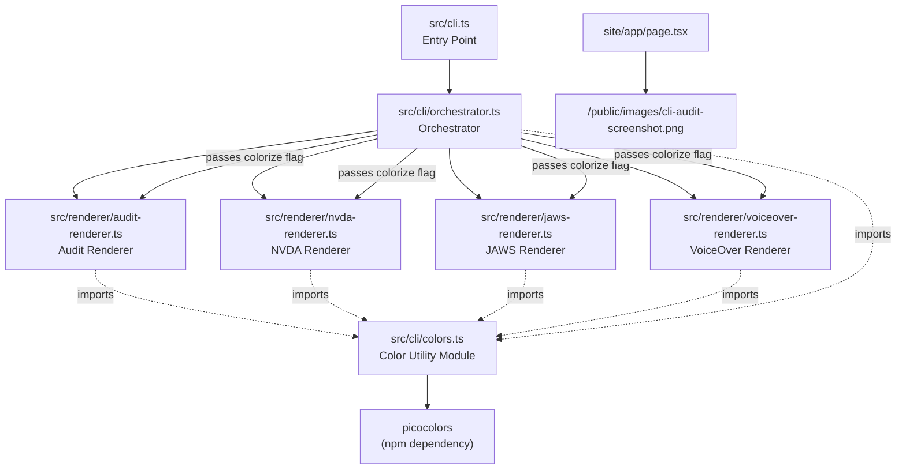
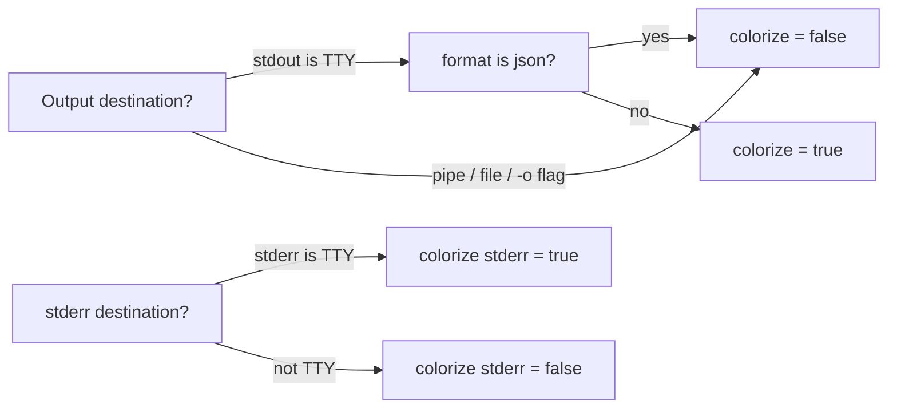

# Design Document: Colorized CLI Output

## Overview

This feature adds ANSI color support to AnnounceKit's CLI output, making audit reports and screen reader text visually scannable in interactive terminals. The design introduces a shared color utility module (`src/cli/colors.ts`) that wraps a zero-dependency color library (picocolors), provides TTY-aware toggling, and exposes semantic color functions consumed by the audit renderer, screen reader renderers, and the orchestrator's warning formatter. The landing page enterprise section is also updated to reference a local screenshot asset instead of an external CDN image.

The key design principle is **transparency**: when colors are disabled (non-TTY, file redirect, JSON format), the output is byte-identical to the current plain-text output. Color is purely additive decoration applied at the rendering layer.

## Architecture



The color utility module sits between picocolors and all consumers. Each renderer receives a `colorize: boolean` parameter from the orchestrator. When `colorize` is `false`, the color functions return their input unchanged (identity/passthrough). This keeps the renderers themselves simple — they always call color functions, and the toggle is handled upstream.

### TTY Detection Flow



The orchestrator determines `colorize` for stdout and stderr independently. The `-o` flag (file output) forces `colorize = false` for stdout. JSON format always disables color regardless of TTY.

## Components and Interfaces

### 1. Color Utility Module — `src/cli/colors.ts`

New file. Central module exporting semantic color functions and a TTY detection helper.

```typescript
import pc from 'picocolors';

/** Check if color output should be enabled for a given stream */
export function isColorEnabled(stream: { isTTY?: boolean }): boolean;

/** Create a set of color functions, either active or passthrough */
export function createColors(enabled: boolean): ColorFunctions;

export interface ColorFunctions {
  // Semantic colors for audit report
  error: (s: string) => string;       // red
  warning: (s: string) => string;     // yellow
  info: (s: string) => string;        // blue
  success: (s: string) => string;     // green
  heading: (s: string) => string;     // bold cyan
  title: (s: string) => string;       // bold white / bright cyan
  dim: (s: string) => string;         // dim

  // Semantic colors for screen reader output
  roleName: (s: string) => string;    // cyan
  stateName: (s: string) => string;   // yellow
  elementName: (s: string) => string; // bold white
  sectionHeader: (s: string) => string; // bold bright
  description: (s: string) => string; // dim

  // Utility
  bold: (s: string) => string;
  enabled: boolean;
}
```

When `enabled` is `false`, every function is `(s) => s` (identity). This guarantees zero ANSI codes in non-TTY output without any conditional logic in renderers.

### 2. Audit Renderer Changes — `src/renderer/audit-renderer.ts`

The `renderAuditReport` function signature changes to accept an optional `colorize` parameter:

```typescript
export function renderAuditReport(model: AnnouncementModel, colorize?: boolean): string;
```

Internally, `formatAuditReport` calls `createColors(colorize ?? false)` and applies semantic color functions to:
- Section headers → `heading()`
- Title banner → `title()`
- Error issues → `error()`
- Warning issues → `warning()`
- Info issues → `info()`
- Success indicators → `success()`
- Timestamps, counts → `dim()`

### 3. Screen Reader Renderer Changes — `nvda-renderer.ts`, `jaws-renderer.ts`, `voiceover-renderer.ts`

Each renderer's public function gains an optional `colorize` parameter:

```typescript
export function renderNVDA(model: AnnouncementModel, colorize?: boolean): string;
export function renderJAWS(model: AnnouncementModel, colorize?: boolean): string;
export function renderVoiceOver(model: AnnouncementModel, colorize?: boolean): string;
```

The internal `formatNode*` functions apply:
- `elementName()` to `node.name`
- `roleName()` to role text
- `stateName()` to state text
- `description()` to `node.description`

### 4. Orchestrator Changes — `src/cli/orchestrator.ts`

- Imports `isColorEnabled` and `createColors` from `../cli/colors.js`
- Determines `colorize` for stdout: `isColorEnabled(process.stdout) && format !== 'json' && !options.output`
- Determines `colorizeStderr` for stderr: `isColorEnabled(process.stderr)`
- Passes `colorize` to renderer calls
- Applies color to `formatWarnings` when `colorizeStderr` is true

### 5. Landing Page — `site/app/page.tsx`

- Replace the external `src="https://lh3.googleusercontent.com/..."` URL with `/images/cli-audit-screenshot.png`
- Update the `alt` attribute to describe the actual CLI audit screenshot
- Preserve existing CSS classes (aspect ratio, rounded corners, gradient overlay, hover opacity)

## Data Models

No new data models are introduced. The `AnnouncementModel`, `AccessibleNode`, `AuditReport`, and related types remain unchanged. Color is applied purely at the string-formatting layer — it decorates the output of existing data structures rather than modifying them.

The only new type is the `ColorFunctions` interface in `src/cli/colors.ts`, which is a rendering concern, not a data model.


## Correctness Properties

*A property is a characteristic or behavior that should hold true across all valid executions of a system — essentially, a formal statement about what the system should do. Properties serve as the bridge between human-readable specifications and machine-verifiable correctness guarantees.*

### Property 1: Color transparency — stripping ANSI yields identical plain output

*For any* valid `AnnouncementModel` and any renderer (audit, NVDA, JAWS, VoiceOver), rendering with `colorize=true` and then stripping all ANSI escape codes from the result should produce a string identical to rendering with `colorize=false`.

This is the core correctness guarantee: color is purely decorative and never alters content.

**Validates: Requirements 2.3**

### Property 2: Colorized output contains ANSI escape codes

*For any* valid `AnnouncementModel` that produces non-empty output, rendering with `colorize=true` in a human-readable format (text, audit, both) should produce output that contains at least one ANSI escape sequence (`\x1b[`).

This ensures color is actually being applied when enabled, not silently passing through as identity.

**Validates: Requirements 2.1**

### Property 3: Disabled color produces zero ANSI codes

*For any* valid `AnnouncementModel`, rendering with `colorize=false` should produce output containing zero ANSI escape sequences (`\x1b[`). This also applies to JSON format output regardless of the colorize flag.

**Validates: Requirements 2.2, 2.4**

### Property 4: Audit report semantic color mapping

*For any* valid `AnnouncementModel` rendered as an audit report with `colorize=true`, the output should satisfy all of the following: section header lines contain cyan ANSI codes, error-severity lines contain red ANSI codes, warning-severity lines contain yellow ANSI codes, info-severity lines contain blue ANSI codes, success indicator lines contain green ANSI codes, and the title banner contains bold ANSI codes.

**Validates: Requirements 3.1, 3.2, 3.3, 3.4, 3.5, 3.6, 3.7**

### Property 5: Screen reader output semantic color mapping

*For any* valid `AnnouncementModel` with at least one node that has a name, role, and state, rendering screen reader text with `colorize=true` should produce output where element names are wrapped in bold ANSI codes, role labels are wrapped in cyan ANSI codes, and state information is wrapped in yellow ANSI codes.

**Validates: Requirements 4.1, 4.2, 4.3, 4.4, 4.5**

### Property 6: TTY detection correctness

*For any* stream object, `isColorEnabled(stream)` should return `true` if and only if `stream.isTTY` is `true`. For streams where `isTTY` is `false`, `undefined`, or absent, it should return `false`.

**Validates: Requirements 5.3**

### Property 7: Warning colorization symmetry

*For any* non-empty list of warning strings, formatting with `colorize=true` and stripping ANSI codes should produce output identical to formatting with `colorize=false`. Additionally, formatting with `colorize=true` should produce output containing yellow ANSI codes in the header and warning prefix lines.

**Validates: Requirements 6.1, 6.2, 6.3**

## Error Handling

### Color Library Failures

If picocolors fails to load (unlikely given it's a direct dependency), the color utility module should fall back to identity functions — all color functions return input unchanged. This ensures the CLI never crashes due to a color issue; it simply produces uncolored output.

### Invalid Stream Objects

`isColorEnabled` should handle `null`, `undefined`, or stream objects missing the `isTTY` property gracefully by returning `false`. No color is safer than broken color.

### Missing Screenshot Asset

If the local screenshot image file is missing from `public/images/`, the Next.js `` tag will show a broken image. This is acceptable for development but should be caught by CI. The alt text ensures screen readers still convey meaning.

### Renderer Backward Compatibility

All renderer function signature changes use optional parameters with defaults (`colorize?: boolean` defaulting to `false`). Existing callers that don't pass the parameter get the same behavior as before — no breaking changes.

## Testing Strategy

### Property-Based Tests

Use `fast-check` (already in devDependencies) for property-based testing. Each property test runs a minimum of 100 iterations with randomly generated `AnnouncementModel` instances using the existing `arbitraries.ts` generators in `tests/property/`.

Each property-based test must be tagged with a comment referencing the design property:
- **Feature: colorized-cli-output, Property 1: Color transparency — stripping ANSI yields identical plain output**
- **Feature: colorized-cli-output, Property 2: Colorized output contains ANSI escape codes**
- **Feature: colorized-cli-output, Property 3: Disabled color produces zero ANSI codes**
- **Feature: colorized-cli-output, Property 4: Audit report semantic color mapping**
- **Feature: colorized-cli-output, Property 5: Screen reader output semantic color mapping**
- **Feature: colorized-cli-output, Property 6: TTY detection correctness**
- **Feature: colorized-cli-output, Property 7: Warning colorization symmetry**

A helper function `stripAnsi(s: string): string` that removes all ANSI escape sequences via regex (`/\x1b\[[0-9;]*m/g`) should be created in the test utilities for use across property tests.

### Unit Tests

Unit tests complement property tests for specific examples and edge cases:

- `colors.ts`: Verify `createColors(true)` returns functions that produce ANSI codes; `createColors(false)` returns identity functions; `isColorEnabled` with various stream mocks
- `audit-renderer.ts`: Snapshot test of a known model with `colorize=true` vs `colorize=false`; verify specific color codes appear in expected positions
- `orchestrator.ts`: Verify `formatWarnings` with colorize on/off; verify JSON format never gets colorized
- `page.tsx`: Verify the enterprise section image `src` is a local path and `alt` is descriptive (can be a simple render test)

### Test File Locations

- Property tests: `tests/property/colorized-output.test.ts`
- Unit tests: `tests/unit/cli/colors.test.ts`, updates to existing renderer and orchestrator test files
- Landing page: `site/` test directory (if applicable)
