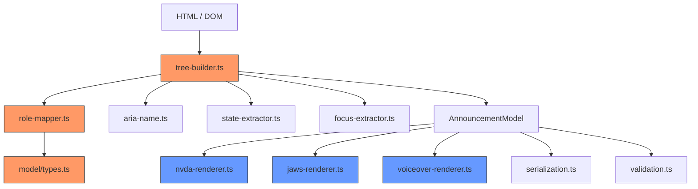

# Design Document: Core Engine Expansion

## Overview

The AnnounceKit core engine currently builds accessibility trees only for elements with explicit or implicit ARIA roles. This means static content that screen readers announce in browse mode — paragraphs, text nodes, tables, blockquotes, figures, definition lists, dialogs, meters, progress bars, and more — is completely dropped. This design expands the tree builder, role mapper, model types, and all three screen reader renderers to achieve full-page content coverage.

The changes touch five areas:
1. **Tree traversal** — `buildNodeRecursive` must traverse through role-less elements, capture Text nodes, handle shadow DOM, and respect inherited hidden state.
2. **Role mapping** — `IMPLICIT_ROLE_MAP` gains 19 new element-to-role entries; `AccessibleRole` and `SUPPORTED_ROLES` gain 18 new roles.
3. **Model types** — The `AccessibleRole` union type and `SUPPORTED_ROLES` array are extended.
4. **Renderers** — NVDA, JAWS, and VoiceOver renderers each gain `case` branches for every new role.
5. **Serialization & validation** — No code changes needed (they already work generically over `SUPPORTED_ROLES`), but the expanded type ensures round-trip correctness.

## Architecture

The expansion follows the existing layered architecture. No new modules are introduced.



Orange = modified for traversal/roles. Blue = modified for rendering.

### Key Design Decisions

1. **Transparent traversal, not wrapper nodes.** When the tree builder encounters a role-less `<div>` or `<span>`, it does not create a `generic` node for it. Instead, it "flattens through" — the accessible children of that element are promoted to the parent's children list. This avoids polluting the tree with meaningless generic containers and matches how browsers build the accessibility tree.

2. **`staticText` as a first-class role.** Text nodes become `AccessibleNode` instances with `role: 'staticText'`, `name` set to the trimmed text content, empty state, and `focusable: false`. This is the simplest representation that lets renderers output the text.

3. **`childNodes` iteration replaces `children` iteration.** The current code uses `element.children` (Element-only). The new code uses `element.childNodes` to pick up Text nodes (nodeType === 3) alongside Element nodes (nodeType === 1).

4. **Shadow DOM: open only.** Closed shadow roots return `null` for `element.shadowRoot`, so they are inherently inaccessible to external traversal. Open shadow roots are traversed first (shadow children before light DOM slotted children) to match browser a11y tree ordering.

5. **Hidden state inheritance is checked early.** Before any extraction, the tree builder checks whether the element or any ancestor is hidden via `aria-hidden="true"`, `display: none`, or `visibility: hidden`. If hidden, the entire subtree is skipped. CSS checks use `getComputedStyle` when available and are skipped gracefully in environments without it (e.g., server-side parsing).

## Components and Interfaces

### 1. `model/types.ts` — Extended AccessibleRole

The `AccessibleRole` union type gains these new members:

| New Role | Source Element(s) |
|---|---|
| `paragraph` | `<p>` |
| `blockquote` | `<blockquote>` |
| `code` | `<code>`, `<pre>` |
| `table` | `<table>` |
| `row` | `<tr>` |
| `cell` | `<td>` |
| `columnheader` | `<th>` (default) |
| `rowheader` | `<th scope="row">` |
| `term` | `<dt>` |
| `definition` | `<dd>` |
| `figure` | `<figure>` |
| `caption` | `<figcaption>` |
| `group` | `<details>` |
| `dialog` | `<dialog>` |
| `meter` | `<meter>` |
| `progressbar` | `<progress>` |
| `status` | `<output>` |
| `document` | `<iframe>` |
| `application` | `<video>`, `<audio>` |
| `separator` | `<hr>` |
| `staticText` | DOM Text nodes |

`SUPPORTED_ROLES` array is extended with all 21 new entries. The existing 22 roles remain unchanged.

### 2. `extractor/role-mapper.ts` — Expanded IMPLICIT_ROLE_MAP

New entries added to `IMPLICIT_ROLE_MAP`:

```typescript
// Static content
'p': 'paragraph',
'blockquote': 'blockquote',
'code': 'code',
'pre': 'code',

// Tables
'table': 'table',
'tr': 'row',
'td': 'cell',
'th': 'columnheader',  // default; scope="row" handled specially

// Definition lists
'dl': 'list',  // dl maps to list role (same as ul/ol)
'dt': 'term',
'dd': 'definition',

// Figures
'figure': 'figure',
'figcaption': 'caption',

// Interactive disclosure
'details': 'group',
'summary': 'button',  // already maps to button behavior

// Dialogs and widgets
'dialog': 'dialog',
'meter': 'meter',
'progress': 'progressbar',
'output': 'status',

// Forms
'fieldset': 'group',    // legend child provides accessible name
'legend': 'caption',

// Embedded content
'iframe': 'document',   // title attribute provides accessible name
'video': 'application', // media player
'audio': 'application', // media player

// Separators
'hr': 'separator',

// Table caption
'caption': 'caption',   // HTML <caption> element (table caption)

// Abbreviations
'abbr': 'text',         // title attribute provides accessible description
```

Special handling for `<th>`:
- `<th>` defaults to `columnheader`
- `<th scope="row">` maps to `rowheader`
- This is handled in `computeImplicitRole` with a special case, similar to the existing `<input>` type handling

The `isAccessible()` function remains unchanged in logic — it already returns `true` for any element with a non-null computed role. Since the new elements now have implicit roles, they will automatically pass the accessibility check.

### 3. `extractor/tree-builder.ts` — Revised Traversal

#### `buildNodeRecursive` changes

Current behavior:
```
if (!isAccessible(element)) return null;
// ... extract role, name, state, etc.
// iterate element.children (Element nodes only)
```

New behavior:
```
if (isHidden(element)) return null;          // NEW: check inherited hidden state first
if (!isAccessible(element)) {
  // NEW: transparent traversal — collect children from this role-less element
  return collectChildrenFromRolelessElement(element, warnings);
}
// ... extract role, name, state, etc. (unchanged)
// iterate element.childNodes (includes Text nodes)  // CHANGED
```

#### New helper: `isHidden(element)`

```typescript
function isHidden(element: Element): boolean {
  // Check aria-hidden on element itself
  if (element.getAttribute('aria-hidden') === 'true') return true;

  // Check CSS hidden state if getComputedStyle is available
  if (typeof getComputedStyle === 'function') {
    try {
      const style = getComputedStyle(element);
      if (style.display === 'none') return true;
      if (style.visibility === 'hidden') return true;
    } catch {
      // Environment doesn't support getComputedStyle — skip CSS checks
    }
  }

  return false;
}
```

Hidden state inheritance is handled by the recursive nature of the traversal: if a parent is hidden, `buildNodeRecursive` returns null/empty for it, so its children are never visited. The `isHidden` check is performed before `isAccessible` to short-circuit early.

Note: The existing `isAccessible()` in `role-mapper.ts` already checks `aria-hidden="true"` on the element itself. The new `isHidden()` adds CSS-based checks (`display: none`, `visibility: hidden`) and is called first in the traversal. The `aria-hidden` check in `isAccessible()` remains as a secondary guard but the primary check is now `isHidden()`.

#### New helper: `collectChildrenFromRolelessElement`

When an element has no role, we don't create a node for it. Instead, we collect its accessible children (both Element and Text nodes) and return them as a flat array to be merged into the parent's children list.

```typescript
function collectChildrenFromRolelessElement(
  element: Element,
  warnings: TreeBuildWarning[]
): AccessibleNode[] {
  const children: AccessibleNode[] = [];
  // Traverse shadow DOM first if present
  if (element.shadowRoot) {
    for (const child of Array.from(element.shadowRoot.childNodes)) {
      processChildNode(child, children, warnings);
    }
  }
  // Then light DOM
  for (const child of Array.from(element.childNodes)) {
    processChildNode(child, children, warnings);
  }
  return children;
}
```

#### Revised child iteration in `buildNodeRecursive`

The existing loop:
```typescript
for (const child of Array.from(element.children)) {
  const childNode = buildNodeRecursive(child, warnings);
  if (childNode) children.push(childNode);
}
```

Becomes:
```typescript
// Shadow DOM first
if (element.shadowRoot) {
  for (const child of Array.from(element.shadowRoot.childNodes)) {
    processChildNode(child, children, warnings);
  }
}
// Light DOM
for (const child of Array.from(element.childNodes)) {
  processChildNode(child, children, warnings);
}
```

#### New helper: `processChildNode`

```typescript
function processChildNode(
  node: Node,
  children: AccessibleNode[],
  warnings: TreeBuildWarning[]
): void {
  if (node.nodeType === 3) { // TEXT_NODE
    const text = (node.textContent || '').trim();
    if (text.length > 0) {
      children.push({
        role: 'staticText',
        name: text,
        state: {},
        focus: { focusable: false },
        children: [],
      });
    }
    return;
  }
  if (node.nodeType === 1) { // ELEMENT_NODE
    const element = node as Element;
    if (isHidden(element)) return;
    if (!isAccessible(element)) {
      // Transparent traversal: collect children from role-less element
      const grandchildren = collectChildrenFromRolelessElement(element, warnings);
      children.push(...grandchildren);
      return;
    }
    const childNode = buildNodeRecursive(element, warnings);
    if (childNode) children.push(childNode);
  }
}
```

#### `createGenericContainer` changes

The `createGenericContainer` function (used only for the root element) also needs to iterate `childNodes` instead of `children`, using the same `processChildNode` helper.

### 4. Renderer Changes

Each renderer's `formatRole*` function gains new `case` branches. The `renderNode*` and `formatNode*` functions are unchanged in structure.

#### NVDA Renderer (`nvda-renderer.ts`)

| Role | Output |
|---|---|
| `staticText` | `''` (no role text; name is output directly) |
| `paragraph` | `''` (no role announcement) |
| `blockquote` | `'block quote'` |
| `code` | `'code'` |
| `table` | `'table'` |
| `row` | `'row'` |
| `cell` | `''` (no role text; content output as name) |
| `columnheader` | `'column header'` |
| `rowheader` | `'row header'` |
| `term` | `''` (no role text) |
| `definition` | `''` (no role text) |
| `figure` | `'figure'` |
| `caption` | `''` (no role text; caption text output as name) |
| `dialog` | `'dialog'` |
| `meter` | `'meter'` (value text prepended via existing value handling) |
| `progressbar` | `'progress bar'` (value text prepended via existing value handling) |
| `status` | `'status'` (content as live region) |
| `group` | `'grouping'` (only when node has a name; `''` otherwise) |
| `document` | `'document'` (with title as name for iframes) |
| `application` | `'embedded object'` (for video/audio) |
| `separator` | `'separator'` |

| Role | Output |
|---|---|
| `staticText` | `''` (no role text) |
| `paragraph` | `''` (no role announcement) |
| `blockquote` | `'block quote'` |
| `code` | `'code'` |
| `table` | `'table with N rows and M columns'` (counts from children) |
| `row` | `'row N'` (position from `state.posinset` or child index) |
| `cell` | `'column N'` (position from `state.posinset` or child index) |
| `columnheader` | `'column header'` |
| `rowheader` | `'row header'` |
| `term` | `''` (no role text) |
| `definition` | `''` (no role text) |
| `figure` | `'figure'` |
| `caption` | `''` (no role text) |
| `dialog` | `'dialog'` |
| `meter` | `'meter'` |
| `progressbar` | `'progress bar'` |
| `status` | `'status'` |
| `group` | `'group'` (only when node has a name) |
| `document` | `'frame'` (with title as name for iframes) |
| `application` | `'embedded object'` (for video/audio) |
| `separator` | `'separator'` |

For JAWS table/row/cell counting: the renderer inspects `node.children` to count rows (children with `role === 'row'`) and columns (children of the first row). Row and cell position indices are derived from the node's position among its siblings or from `state.posinset` if set.

#### VoiceOver Renderer (`voiceover-renderer.ts`)

| Role | Output |
|---|---|
| `staticText` | `''` (no role text) |
| `paragraph` | `''` (no role announcement) |
| `blockquote` | `'blockquote'` |
| `code` | `'code'` |
| `table` | `'table, N rows, M columns'` (counts from children) |
| `row` | `'row'` |
| `cell` | `''` (no role text) |
| `columnheader` | `'column header'` |
| `rowheader` | `'row header'` |
| `term` | `''` (no role text) |
| `definition` | `''` (no role text) |
| `figure` | `'figure'` |
| `caption` | `''` (no role text) |
| `dialog` | `'web dialog'` |
| `meter` | `'level indicator'` |
| `progressbar` | `'progress indicator'` |
| `status` | `'status'` |
| `group` | `'group'` (only when node has a name) |
| `document` | `'frame'` (with title as name for iframes) |
| `application` | `'embedded object'` (for video/audio) |
| `separator` | `'separator'` |

The `shouldAnnounceRoleFirst` function in VoiceOver is updated to include `blockquote`, `figure`, `dialog`, `group`, and `document` (roles where VoiceOver announces the role before the name).

### 5. Serialization & Validation

`serialization.ts` requires no code changes — `serializeModel` and `deserializeModel` work generically over the `AnnouncementModel` structure. The new roles are just new string values in the `role` field.

`validation.ts` requires no code changes — `validateRole` checks against `SUPPORTED_ROLES`, which is extended in `types.ts`. The validation automatically accepts new roles once they're in the array.

## Data Models

### Extended AccessibleRole Type

```typescript
export type AccessibleRole =
  // Existing roles (22)
  | 'button' | 'link' | 'heading' | 'textbox' | 'checkbox'
  | 'radio' | 'combobox' | 'listbox' | 'option' | 'list'
  | 'listitem' | 'navigation' | 'main' | 'banner' | 'contentinfo'
  | 'region' | 'img' | 'article' | 'complementary' | 'form'
  | 'search' | 'generic'
  // New roles (21)
  | 'paragraph' | 'blockquote' | 'code' | 'table' | 'row'
  | 'cell' | 'columnheader' | 'rowheader' | 'term' | 'definition'
  | 'figure' | 'caption' | 'group' | 'dialog' | 'meter'
  | 'progressbar' | 'status' | 'document' | 'application'
  | 'separator' | 'staticText';
```

### staticText Node Shape

```typescript
{
  role: 'staticText',
  name: 'The trimmed text content',
  state: {},
  focus: { focusable: false },
  children: [],  // staticText nodes never have children
}
```

### AccessibleNode — No Structural Changes

The `AccessibleNode` interface is unchanged. The `role` field simply accepts more values. No new fields are added.

## Correctness Properties

*A property is a characteristic or behavior that should hold true across all valid executions of a system — essentially, a formal statement about what the system should do. Properties serve as the bridge between human-readable specifications and machine-verifiable correctness guarantees.*

### Property 1: Transparent traversal finds accessible descendants

*For any* HTML document where accessible elements (elements with ARIA roles) are nested inside one or more role-less container elements (e.g., `<div>`, `<span>`), the tree builder should produce an accessibility tree that contains those accessible elements as nodes, regardless of the depth of role-less nesting.

**Validates: Requirements 1.1, 1.2**

### Property 2: Role-less subtrees without content are pruned

*For any* HTML subtree composed entirely of role-less elements with no Text nodes containing non-whitespace characters, the tree builder should produce no AccessibleNodes for that subtree.

**Validates: Requirements 1.3**

### Property 3: Parent-child nesting is preserved through role-less intermediaries

*For any* HTML structure where accessible element A contains a role-less element which contains accessible element B, the resulting accessibility tree should have B as a child (direct or transitive) of A, preserving the correct hierarchical relationship.

**Validates: Requirements 1.4**

### Property 4: All new roles are valid in SUPPORTED_ROLES and pass validation

*For any* role in the set {paragraph, blockquote, code, table, row, cell, columnheader, rowheader, term, definition, figure, caption, group, dialog, meter, progressbar, status, staticText}, that role should be present in `SUPPORTED_ROLES` and `validateRole` should return true for it.

**Validates: Requirements 2.20, 3.4, 9.4**

### Property 5: Non-whitespace text nodes become staticText nodes

*For any* DOM Text node containing at least one non-whitespace character, when the tree builder processes the parent element, the resulting accessibility tree should contain an AccessibleNode with `role: 'staticText'` and `name` equal to the trimmed text content of that Text node. Conversely, Text nodes containing only whitespace should not produce any AccessibleNode.

**Validates: Requirements 3.1, 3.2, 3.3**

### Property 6: Document order of text and element nodes is preserved

*For any* parent element containing interleaved Text nodes and Element nodes, the tree builder should produce children in the same document order as the source DOM — text nodes and element nodes should appear in the order they occur in `childNodes`.

**Validates: Requirements 3.5**

### Property 7: Shadow DOM children are included and ordered before light DOM

*For any* element with an open `shadowRoot` containing accessible elements, the tree builder should include those shadow DOM elements as AccessibleNodes, and they should appear before any light DOM children in the resulting children array.

**Validates: Requirements 4.1, 4.3, 4.4**

### Property 8: Hidden ancestor exclusion

*For any* element that has an ancestor with `aria-hidden="true"`, `display: none`, or `visibility: hidden`, the tree builder should exclude that element and all its descendants from the accessibility tree.

**Validates: Requirements 5.1, 5.2, 5.3**

### Property 9: Renderer output correctness for new roles

*For any* AccessibleNode with a role in the new roles set, each renderer (NVDA, JAWS, VoiceOver) should produce output containing the expected role text for that role (e.g., NVDA outputs "block quote" for `blockquote`, JAWS outputs "dialog" for `dialog`, VoiceOver outputs "web dialog" for `dialog`). Roles that should not produce role text (`staticText`, `paragraph`, `cell`, `term`, `definition`, `caption`) should produce output containing only the node's name without a role label.

**Validates: Requirements 6.1–6.18, 7.1–7.18, 8.1–8.18**

### Property 10: Serialization round-trip for expanded models

*For any* valid `AnnouncementModel` containing nodes with any of the new roles, serializing to JSON and then deserializing should produce an equivalent model (deep equality).

**Validates: Requirements 9.1, 9.2, 9.3**

### Property 11: Backward-compatible tree superset

*For any* HTML document containing only elements that had implicit roles in the pre-expansion engine (buttons, links, headings, form controls, landmarks, lists, images, articles), the new tree builder should produce an accessibility tree where every node from the pre-expansion output is still present with the same role, name, and state. The new tree may contain additional `staticText` nodes.

**Validates: Requirements 10.3**

### Property 12: Renderer backward compatibility for pre-expansion roles

*For any* `AnnouncementModel` containing only pre-expansion roles (the original 22 roles), each renderer should produce identical output to the pre-expansion version of that renderer.

**Validates: Requirements 10.4**

## Error Handling

### Hidden state check failures

When `getComputedStyle` is unavailable (server-side environments), the tree builder catches the error and falls back to `aria-hidden`-only checking. No error is thrown to the caller.

### Invalid role fallback

The existing behavior in `computeRole` is preserved: if an explicit `role` attribute contains an unsupported value, a warning is emitted and the engine falls back to the implicit role. With the expanded `SUPPORTED_ROLES`, more explicit roles will now be recognized.

### Malformed HTML

The tree builder is tolerant of malformed HTML (e.g., `<td>` outside `<table>`). Elements are processed based on their tag name regardless of context. The role mapper maps `<td>` to `cell` even if it's not inside a `<table>`. This matches browser behavior where the accessibility tree is built from the parsed DOM, not the source HTML.

### Empty trees

If the entire document is hidden or contains no accessible elements and no text nodes, the tree builder returns a `generic` root with an empty children array, same as today.

## Testing Strategy

### Dual Testing Approach

The testing strategy uses both unit tests and property-based tests:

- **Unit tests**: Verify specific examples for each new role mapping, each renderer's output for each new role, edge cases (empty text nodes, deeply nested role-less elements, closed shadow roots, CSS-hidden elements).
- **Property-based tests**: Verify universal properties across randomly generated inputs using `fast-check`.

### Property-Based Testing Configuration

- **Library**: `fast-check` (already a devDependency)
- **Minimum iterations**: 100 per property test
- **Tag format**: Each test is tagged with a comment referencing the design property:
  ```
  // Feature: core-engine-expansion, Property N: <property text>
  ```
- **Each correctness property is implemented by a single property-based test.**

### Test Plan

**Unit tests** (in `tests/unit/`):
- `extractor/role-mapper.test.ts` — Add cases for all 19 new IMPLICIT_ROLE_MAP entries (2.1–2.19), including `<th scope="row">` → `rowheader`.
- `extractor/tree-builder.test.ts` — Add cases for: role-less traversal, text node capture, whitespace filtering, shadow DOM traversal, hidden state inheritance, CSS hidden checks.
- `renderer/nvda-renderer.test.ts` — Add cases for each new role's output format.
- `renderer/jaws-renderer.test.ts` — Add cases for each new role's output format, including table/row/cell counting.
- `renderer/voiceover-renderer.test.ts` — Add cases for each new role's output format.
- `model/validation.test.ts` — Add cases verifying new roles pass validation.

**Property tests** (in `tests/property/`):
- `tree-traversal-expansion.test.ts` — Properties 1, 2, 3, 5, 6, 7, 8
- `role-expansion.test.ts` — Property 4
- `renderer-expansion.test.ts` — Properties 9, 12
- `model-serialization.test.ts` — Property 10 (extend existing test file)
- `backward-compatibility.test.ts` — Property 11

**Existing tests**: All 562 CLI tests and 77 web tests must continue passing without modification. This is verified by running the existing test suite after changes.
