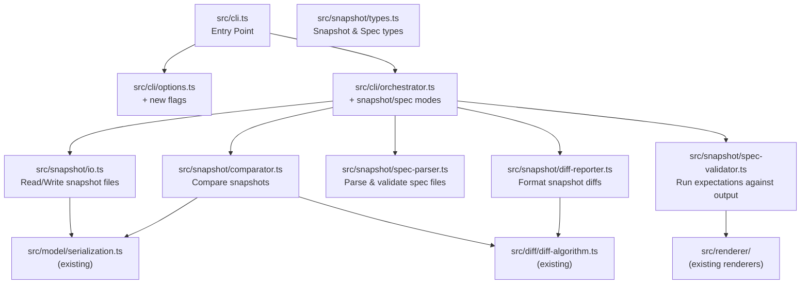

# Design Document: Snapshot Testing

## Overview

This feature adds announcement snapshot testing to the AnnounceKit CLI, enabling teams to save baseline screen reader output and compare against it in CI/CD pipelines. It introduces four capabilities:

1. **Snapshot mode** — save and compare announcement baselines via `--snapshot <dir>`
2. **Spec file validation** — author expected output patterns in `.announcekit-spec` / `.a11y-spec.json` files and validate with `--spec <path>`
3. **CI/CD integration** — machine-readable JSON output via `--ci`, non-zero exit codes via `--fail-on-change`
4. **Baseline management** — update snapshots with `--update-snapshot`, partial updates with `--selector`

The design builds on three existing modules:
- `src/model/serialization.ts` — deterministic JSON serialization (sorted keys) used for snapshot file content
- `src/diff/diff-algorithm.ts` — tree diffing used by the snapshot comparator to detect changes
- `src/cli/` — CLI options, I/O, and orchestrator that will be extended with new flags and modes

New CLI flags: `--snapshot`, `--update-snapshot`, `--spec`, `--fail-on-change`, `--ci`

Exit codes: 0 = success/match, 1 = diff detected/expectation failed, 2 = input error, 3 = system error

## Architecture



All new modules live under `src/snapshot/` to keep the feature self-contained. The orchestrator gains new code paths for snapshot mode, spec validation mode, and CI output mode. Existing modules are consumed but not modified (except `src/cli/options.ts` which gets new flag definitions and `src/cli/orchestrator.ts` which gets new processing branches).

## Components and Interfaces

### 1. CLI Options Extension (`src/cli/options.ts`)

New fields added to `CLIOptions`:

```typescript
export interface CLIOptions {
  // ... existing fields ...
  
  /** Snapshot directory path */
  snapshot?: string;
  
  /** Update existing snapshots instead of comparing */
  updateSnapshot: boolean;
  
  /** Path to spec file for validation */
  spec?: string;
  
  /** Exit with code 1 on any snapshot/spec diff */
  failOnChange: boolean;
  
  /** CI mode: suppress colors, JSON output on stdout, progress on stderr */
  ci: boolean;
}
```

New validation rules:
- `--update-snapshot` requires `--snapshot`
- `--fail-on-change` requires `--snapshot` or `--spec`
- `--snapshot` is mutually exclusive with `--diff`

### 2. Snapshot Types (`src/snapshot/types.ts`)

```typescript
/** On-disk snapshot file format */
export interface SnapshotFile {
  version: string;              // e.g. "1.0"
  inputFile: string;            // relative path, forward slashes
  screenReader: string;         // "nvda" | "jaws" | "voiceover" | "all"
  model: AnnouncementModel;     // the full accessibility model
  screenReaderOutput: Record<string, string>;  // reader name → rendered text
  createdAt: string;            // ISO 8601 timestamp
}

/** Result of comparing two snapshots */
export interface SnapshotComparisonResult {
  match: boolean;
  modelDiff: SemanticDiff | null;
  textDiffs: Record<string, TextDiff>;  // reader name → text diff
}

/** Simple text diff for screen reader output strings */
export interface TextDiff {
  expected: string;
  actual: string;
  equal: boolean;
}

/** Spec file format */
export interface SpecFile {
  file: string;                 // path to HTML file
  screenReader: string;         // which reader to use
  expectations: Expectation[];
}

/** Single expectation in a spec file */
export interface Expectation {
  selector: string;             // CSS selector
  contains?: string[];          // substring checks
  matches?: string;             // glob pattern check
}

/** Result of validating one expectation */
export interface ExpectationResult {
  selector: string;
  passed: boolean;
  expected: string;             // the pattern or substrings
  actual: string;               // what was actually rendered
  message?: string;             // failure reason
}

/** CI JSON summary output */
export interface CISummary {
  status: "pass" | "fail" | "error";
  snapshotFile?: string;
  specFile?: string;
  changes?: {
    added: number;
    removed: number;
    changed: number;
  };
  expectations?: {
    total: number;
    passed: number;
    failed: number;
  };
}
```

### 3. Snapshot I/O (`src/snapshot/io.ts`)

```typescript
/** Derive snapshot filename from input filename */
export function snapshotFileName(inputFile: string): string;

/** Resolve full snapshot file path */
export function resolveSnapshotPath(snapshotDir: string, inputFile: string): string;

/** Write a SnapshotFile to disk with deterministic JSON */
export function writeSnapshot(path: string, snapshot: SnapshotFile): void;

/** Read and parse a SnapshotFile from disk */
export function readSnapshot(path: string): SnapshotFile | null;

/** Ensure snapshot directory exists, creating intermediate dirs */
export function ensureSnapshotDir(dir: string): void;

/** Serialize a SnapshotFile to deterministic JSON string */
export function serializeSnapshot(snapshot: SnapshotFile): string;

/** Deserialize a JSON string to a SnapshotFile */
export function deserializeSnapshot(json: string): SnapshotFile;
```

### 4. Snapshot Comparator (`src/snapshot/comparator.ts`)

```typescript
/** Compare current output against a saved snapshot */
export function compareSnapshots(
  saved: SnapshotFile,
  current: SnapshotFile
): SnapshotComparisonResult;
```

The comparator:
- Uses `diffAccessibilityTrees()` from `src/diff/diff-algorithm.ts` to diff the model trees
- Ignores `metadata.extractedAt` and `createdAt` fields (timestamps differ between runs)
- Compares `screenReaderOutput` entries as plain string equality per reader

### 5. Spec File Parser (`src/snapshot/spec-parser.ts`)

```typescript
/** Parse a spec file from a JSON string */
export function parseSpecFile(json: string, filePath: string): SpecFile;

/** Serialize a SpecFile back to pretty-printed JSON */
export function serializeSpecFile(spec: SpecFile): string;

/** Read and parse a spec file from disk */
export function loadSpecFile(path: string): SpecFile;

/** Validate spec file structure, throw on invalid */
export function validateSpecFileStructure(data: unknown, filePath: string): SpecFile;
```

Accepted extensions: `.announcekit-spec`, `.a11y-spec.json`

### 6. Spec Validator (`src/snapshot/spec-validator.ts`)

```typescript
/** Validate all expectations in a spec file against actual HTML output */
export function validateSpec(
  spec: SpecFile,
  html: string,
  screenReader: string
): ExpectationResult[];

/** Check a single "contains" expectation */
export function checkContains(output: string, substrings: string[]): boolean;

/** Check a single "matches" expectation (glob pattern) */
export function checkMatches(output: string, pattern: string): boolean;

/** Convert a glob pattern to a RegExp */
export function globToRegex(pattern: string): RegExp;
```

### 7. Diff Reporter (`src/snapshot/diff-reporter.ts`)

```typescript
/** Format a SnapshotComparisonResult as human-readable text */
export function formatSnapshotDiff(
  result: SnapshotComparisonResult,
  options: { color: boolean }
): string;

/** Format expectation results as a report */
export function formatExpectationReport(
  results: ExpectationResult[],
  options: { color: boolean }
): string;

/** Format a CI JSON summary */
export function formatCISummary(summary: CISummary): string;
```

### 8. Orchestrator Extensions (`src/cli/orchestrator.ts`)

New processing branches added to the orchestrator:

```typescript
/** Process snapshot mode (save, compare, or update) */
function processSnapshot(
  html: string,
  options: CLIOptions,
  inputFile: string
): ProcessResult;

/** Process spec validation mode */
function processSpec(
  options: CLIOptions
): ProcessResult;

/** Process batch snapshot mode */
function processBatchSnapshot(
  filePaths: string[],
  options: CLIOptions
): BatchProcessResult;
```

## Data Models

### Snapshot File (on disk)

```json
{
  "version": "1.0",
  "inputFile": "components/button.html",
  "screenReader": "nvda",
  "model": {
    "metadata": { "extractedAt": "...", "sourceHash": "..." },
    "root": { /* AccessibleNode tree, sorted keys */ },
    "version": { "major": 1, "minor": 0 }
  },
  "screenReaderOutput": {
    "nvda": "button, Submit, clickable"
  },
  "createdAt": "2024-01-15T10:30:00.000Z"
}
```

Key properties:
- All keys sorted deterministically (using existing `sortObjectKeys` from serialization module)
- Pretty-printed with 2-space indentation
- `inputFile` uses forward slashes for cross-platform consistency
- `model` contains the full `AnnouncementModel` structure

### Spec File (on disk)

```json
{
  "file": "components/button.html",
  "screenReader": "nvda",
  "expectations": [
    {
      "selector": "button.submit",
      "contains": ["Submit", "button"]
    },
    {
      "selector": "input[type=email]",
      "matches": "*email*textbox*"
    }
  ]
}
```

### CI Summary Output (stdout)

```json
{
  "status": "fail",
  "snapshotFile": ".announcekit/snapshots/button.html.snap",
  "changes": {
    "added": 0,
    "removed": 1,
    "changed": 2
  }
}
```

### Snapshot Filename Derivation

| Input file | Snapshot file |
|---|---|
| `index.html` | `index.html.snap` |
| `components/button.html` | `components/button.html.snap` |
| `../page.html` | `../page.html.snap` |

The snapshot file is placed in the snapshot directory, using only the basename of the input file: `<snapshotDir>/<basename>.snap`.

### Directory Resolution

- `--snapshot ./snapshots` → resolves relative to `process.cwd()`
- `--snapshot` (no arg) → defaults to `.announcekit/snapshots/`
- All paths in snapshot metadata normalized to forward slashes


## Correctness Properties

*A property is a characteristic or behavior that should hold true across all valid executions of a system — essentially, a formal statement about what the system should do. Properties serve as the bridge between human-readable specifications and machine-verifiable correctness guarantees.*

### Property 1: Snapshot filename derivation

*For any* input filename string, `snapshotFileName(input)` should return the input with `.snap` appended, and the result should always end with `.snap`.

**Validates: Requirements 1.2**

### Property 2: Snapshot file structure completeness

*For any* valid `SnapshotFile` object, serializing it to JSON should produce an object containing exactly the keys `version`, `inputFile`, `screenReader`, `model`, `screenReaderOutput`, and `createdAt`, and the `screenReaderOutput` value should be an object mapping reader names to strings.

**Validates: Requirements 1.4, 4.1, 4.6**

### Property 3: Screen reader output filtering

*For any* valid `AnnouncementModel` and any single screen reader choice from `{nvda, jaws, voiceover}`, the resulting snapshot's `screenReaderOutput` object should contain exactly one key matching that reader. When the choice is `all`, it should contain exactly three keys.

**Validates: Requirements 1.5, 1.6**

### Property 4: Snapshot round-trip serialization

*For any* valid `SnapshotFile` object, serializing to JSON, then deserializing, then re-serializing should produce a byte-identical JSON string.

**Validates: Requirements 4.2, 4.3, 4.4**

### Property 5: Snapshot self-comparison is always a match

*For any* valid `SnapshotFile`, comparing it against a copy of itself where only `metadata.extractedAt` and `createdAt` differ should produce `match: true` with no model diff and no text diffs.

**Validates: Requirements 2.2, 2.6**

### Property 6: Snapshot comparator detects model and text differences

*For any* two valid `SnapshotFile` objects that differ in either the `model` tree structure or any `screenReaderOutput` value, `compareSnapshots` should return `match: false`.

**Validates: Requirements 2.3, 2.5**

### Property 7: Partial snapshot update preserves unmatched content

*For any* valid `SnapshotFile` and any CSS selector, performing a partial update (with `--update-snapshot --selector`) should leave the `screenReaderOutput` and model subtrees for elements not matching the selector byte-identical to the original snapshot.

**Validates: Requirements 3.5**

### Property 8: Diff report contains required elements

*For any* `SnapshotComparisonResult` with at least one difference, the formatted diff report should contain: a section header for each screen reader with diffs, `+` prefixed lines for additions, `-` prefixed lines for removals, both old and new values for modifications, and the tree path of each changed node.

**Validates: Requirements 5.1, 5.2, 5.3, 5.4**

### Property 9: Color output controlled by flag

*For any* `SnapshotComparisonResult` with differences, formatting with `color: false` should produce output containing zero ANSI escape sequences (`\x1b[`), and formatting with `color: true` should produce output containing at least one ANSI escape sequence.

**Validates: Requirements 5.5, 5.6**

### Property 10: Contains expectation checks all substrings

*For any* output string and any list of substrings, `checkContains(output, substrings)` should return `true` if and only if every substring in the list is present in the output string.

**Validates: Requirements 6.3**

### Property 11: Glob pattern matching — literal round-trip

*For any* string that contains no glob special characters (`*`, `?`, `[`, `]`), `checkMatches(str, str)` should return `true` (a literal string matches itself as a glob pattern).

**Validates: Requirements 6.4**

### Property 12: Spec file round-trip serialization

*For any* valid `SpecFile` object, serializing to JSON, then parsing, then re-serializing should produce a byte-identical JSON string.

**Validates: Requirements 6.7**

### Property 13: Expectation failure report contains required fields

*For any* `ExpectationResult` where `passed` is `false`, the formatted failure report should contain the CSS selector, the expected pattern or substrings, and the actual screen reader output.

**Validates: Requirements 7.4**

### Property 14: CI summary is valid JSON with required structure

*For any* `CISummary` object, `formatCISummary` should produce a string that parses as valid JSON and contains the `status` field, plus `snapshotFile` or `specFile` and the relevant `changes` or `expectations` sub-object.

**Validates: Requirements 8.2**

### Property 15: Path normalization uses forward slashes

*For any* file path string, the normalized path stored in snapshot metadata should contain no backslash characters.

**Validates: Requirements 10.4**

## Error Handling

| Scenario | Exit Code | Output |
|---|---|---|
| Snapshot dir not writable | 3 | Error message to stderr |
| `--update-snapshot` without `--snapshot` | 1 | Error: `--snapshot <dir>` is required |
| `--fail-on-change` without `--snapshot`/`--spec` | 1 | Error: `--snapshot` or `--spec` is required |
| `--snapshot` with `--diff` | 1 | Error: snapshot and diff modes are mutually exclusive |
| Spec file malformed JSON | 2 | Parse error with file path to stderr |
| Spec file missing required fields | 2 | Validation error with field name to stderr |
| Spec file references non-existent HTML | 2 | File not found error to stderr |
| Expectation selector matches no elements | 1 | Reported as failed expectation: "no elements matched" |
| Batch file not found | continues | Error included in batch summary, other files still processed |
| Snapshot comparison detects diff | 1 | Diff report to stdout |
| All expectations pass | 0 | Success summary to stdout |
| Any expectation fails | 1 | Failure report to stdout |

Error messages follow the existing pattern in `src/cli/io.ts` — `Error: <descriptive message>` written to stderr. In CI mode, errors are still written to stderr while structured output goes to stdout.

## Testing Strategy

### Property-Based Testing

Use `fast-check` (already in devDependencies) with minimum 100 iterations per property test.

New test file: `tests/property/snapshot-testing.test.ts`

New arbitraries needed in `tests/property/arbitraries.ts`:
- `arbitrarySnapshotFile()` — generates valid `SnapshotFile` objects using existing `arbitraryAnnouncementModel()`
- `arbitrarySpecFile()` — generates valid `SpecFile` objects with random selectors and expectations
- `arbitraryExpectationResult()` — generates `ExpectationResult` objects
- `arbitraryCISummary()` — generates `CISummary` objects

Each property test must be tagged with a comment referencing the design property:
```typescript
// Feature: snapshot-testing, Property 4: Snapshot round-trip serialization
```

Property tests cover:
- Properties 1–15 as defined above
- Each property implemented as a single `fc.assert(fc.property(...))` call

### Unit Testing

New test files:
- `tests/unit/snapshot/io.test.ts` — snapshot file I/O, directory creation, filename derivation
- `tests/unit/snapshot/comparator.test.ts` — snapshot comparison with specific examples
- `tests/unit/snapshot/spec-parser.test.ts` — spec file parsing, validation errors, edge cases
- `tests/unit/snapshot/spec-validator.test.ts` — contains/matches checks, glob-to-regex conversion
- `tests/unit/snapshot/diff-reporter.test.ts` — diff formatting, color output, CI summary
- `tests/unit/cli/options-snapshot.test.ts` — new flag validation, mutual exclusivity checks

Unit tests focus on:
- Specific examples demonstrating correct behavior (e.g., known HTML → known snapshot)
- Error conditions (malformed spec files, missing fields, invalid paths)
- Edge cases (empty expectations list, selector matching no elements, empty diff)
- Integration points (orchestrator routing to correct mode based on flags)

### Integration Testing

New test file: `tests/integration/snapshot-workflow.test.ts`

Covers end-to-end workflows:
- Save snapshot → compare (match) → modify HTML → compare (diff) → update → compare (match)
- Spec file validation with passing and failing expectations
- Batch snapshot processing with mixed results
- CI mode output format verification
